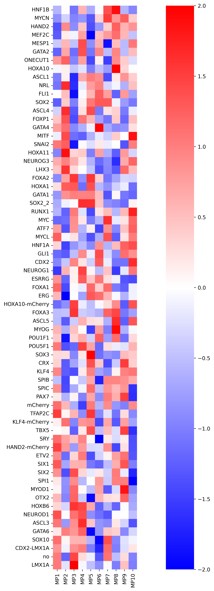
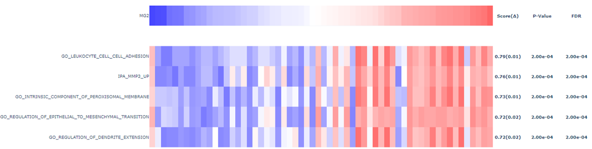
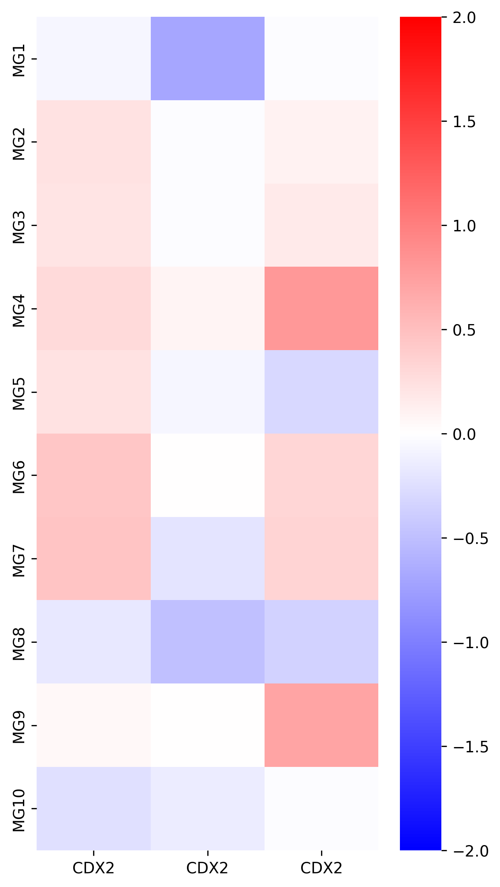
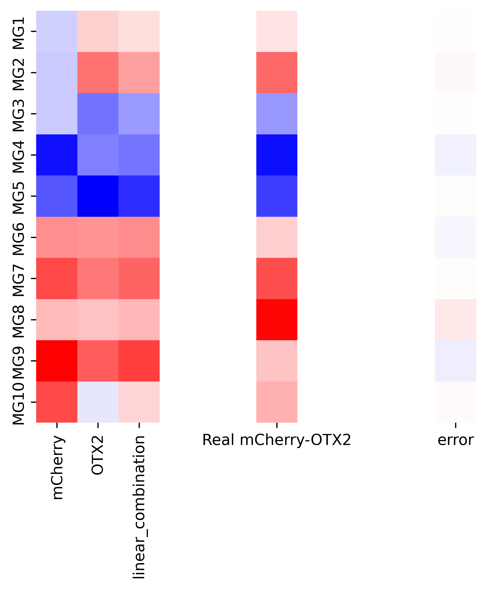
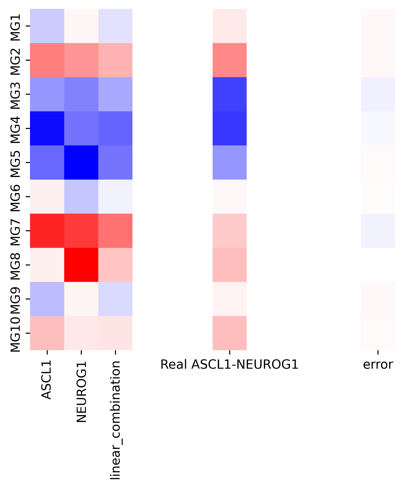
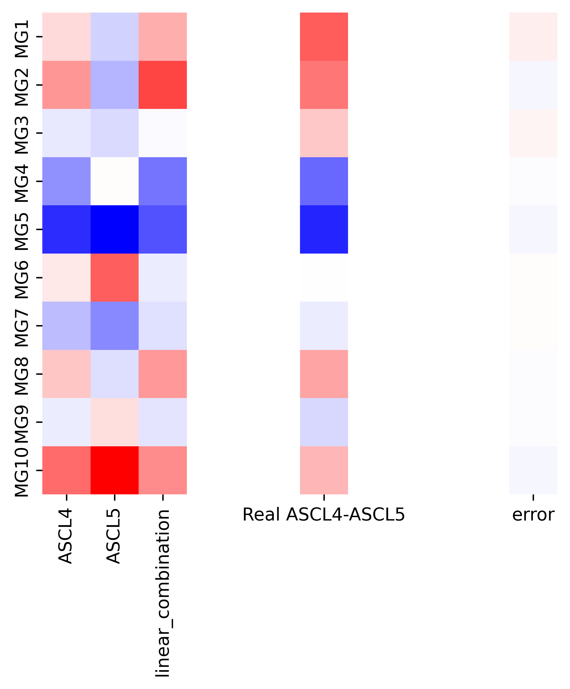
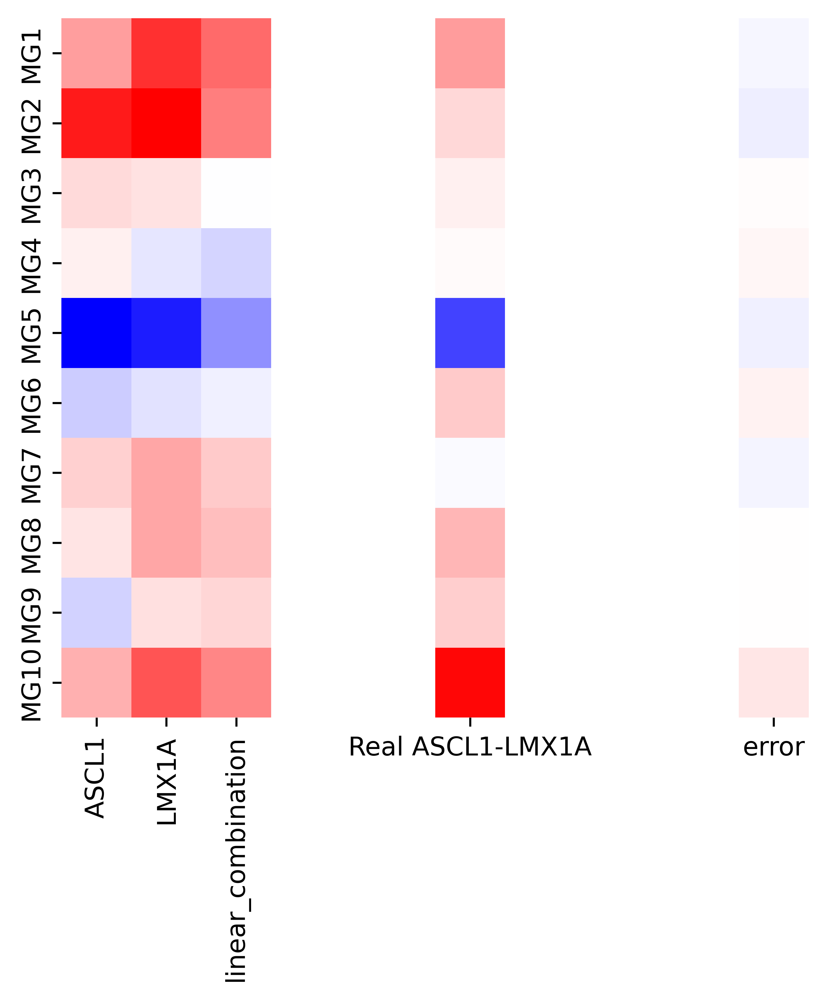

# DSC291 Spring 2022 Project: Group 11 Tensor Factorization
Timothy Pham
Myroslav Tkachenko

All analysis code is located in the notebook file in the "notebooks" folder.

# Instructions:
## 0. Install missing packages (if needed)
Python packages used:
- Numpy
- Tensorly
- SciPy
- Pandas
- Matplotlib
- Seaborn
- Plotly
- Statsmodels
- Rpy2 (Rpy2 no longer works on Windows as of 6/9/2022.  The analysis was performed on a computer running Ubuntu 20.04 LTS)

You will also need the R programming language as well to use Seurat to extract the SEUSS paper's SVD-based analysis intermediates and to calculate the information coefficient.  
R Packages used:
- [MASS](https://cran.r-project.org/web/packages/MASS/index.html)
- [Seurat](https://satijalab.org/seurat/)
(For convenience, the SEUSS analysis eigenvectors are provided in the data download so it is not strictly necessary to install Seurat.)

## 1. Download input data
Due to the large size of this data set (multiple gigabytes), it must be downloaded separately from this repository.  It is located here: [https://drive.google.com/file/d/1GGaA5-4bSnxP8iaetJJM7OcJhYPRUuZ2/view?usp=sharing](https://drive.google.com/file/d/1GGaA5-4bSnxP8iaetJJM7OcJhYPRUuZ2/view?usp=sharing)

 ## 2. Unzip the zip file into the data directory.  
 The directory structure should look like this:
 
 ## 3. (OPTIONAL) Extract Seurat Eigenvectors from SEUSS Analysis
 For convenience, the SEUSS analysis eigenvectors are provided in the data download so it is not strictly necessary to perform this step.  
Create a folder in the [data](data) directory called "SEUSS_PCA".  

 The following code can be run from the "notebooks" directory to extract the eigenvectors from the SEUSS PCA plots as CSV files:
 ```
 #Extract the SEUSS_processed_data" file from the SEUSS-Analysis github into the ../data/SEUSS_R/SEUSS_Processed_data directory
#run this from notebooks directory
#since this is a large data set (almost 2GB) we have not included it in the project github
#The output of ths cell, the eigenvector values, can be seen in the ../data/SEUSS_PCA folder
pluripotent_data = readRDS("../data/SEUSS_R/SEUSS_processed_data/pluripotent_media/up-tf-stem_clustering.Robj")
pluripotent_data = UpdateSeuratObject(pluripotent_data)
endothelial_data = readRDS("../data/SEUSS_R/SEUSS_processed_data/endothelial_media/up-tf-endo_clustering.Robj")
endothelial_data = UpdateSeuratObject(endothelial_data)
multilineage_data = readRDS("../data/SEUSS_R/SEUSS_processed_data/multilineage_media/up-tf-multi_clustering.Robj")
multilineage_data = UpdateSeuratObject(multilineage_data)

pluripotent_PCA_embedding = Embeddings(object = pluripotent_data, reduction = "pca")
pluripotent_PCA_loading = Loadings(object = pluripotent_data, reduction = "pca")

write.csv(pluripotent_PCA_embedding,"../data/SEUSS_PCA/pluripotent_PCA_embedding.csv")
write.csv(pluripotent_PCA_loading,"../data/SEUSS_PCA/pluripotent_PCA_gene_loadings.csv")


endothelial_PCA_embedding = Embeddings(object = endothelial_data, reduction = "pca")
endothelial_PCA_loading = Loadings(object = endothelial_data, reduction = "pca")

write.csv(endothelial_PCA_embedding,"../data/SEUSS_PCA/endothelial_PCA_embedding.csv")
write.csv(endothelial_PCA_loading,"../data/SEUSS_PCA/endothelial_PCA_gene_loadings.csv")

multilineage_PCA_embedding = Embeddings(object = multilineage_data, reduction = "pca")
multilineage_PCA_loading = Loadings(object = multilineage_data, reduction = "pca")

write.csv(multilineage_PCA_embedding,"../data/SEUSS_PCA/multilineage_PCA_embedding.csv")
write.csv(multilineage_PCA_loading,"../data/SEUSS_PCA/multilineage_PCA_gene_loadings.csv")
 ```
 
 
 ## 3. Run the analysis code located in [Combined Tensor Project.ipynb](notebooks/Combined Tensor Project.ipynb)
 All cells can be run in sequential order and will output heatmaps and figures as appropriate.  These will be in the [results](results) folder.
 Note that the ssGSEA correlation code will output interactive HTML files, not images.  For the presentation and report, we took a screenshot.  

# Expected Experimental Results:
The plots shown below are the key figures from our report, though the analysis code will output many times more  figures.  

## Side Matrices of Stem Cell Tensor:
**MetaGenes**


**MetaPerturbations**


### Metagenes vs PCA Cell Embeddings:
**Endothelial/Unilineage:**


**Multilineage:**


**Pluripotent:**


## CDX2 Effects Re-Discovered:
MG2 correlates with embryonic morphogenesis related gene sets.


MG2 is consistently high in all media conditions.


## Poor correlation between PCA Eigenvectors and Tucker MetaGene/Perturbation Factors:
### Metaperturbations vs PCA Gene Loadings:
**Endothelial/Unilineage:**


**Multilineage:**


**Pluripotent:**


## Linear Combinations:
**Linear Model Coefficient Heatmap:**
These are averaged across the different samples in the neuron tensor.


### Additive/OR Combinations:
mCherry-OTX2_98.png:

ASCL1-NEUROG1_46.png:


### NAND Combinations:
ASCL4-ASCL5_144.png:


ASCL1-LMX1A_144.png:


These and all other results can also be downloaded here for convenience: [https://drive.google.com/file/d/1mztNi_Oq-2rxr2OU_QeZUkzQeKOwJdCy/view?usp=sharing](https://drive.google.com/file/d/1mztNi_Oq-2rxr2OU_QeZUkzQeKOwJdCy/view?usp=sharing)
